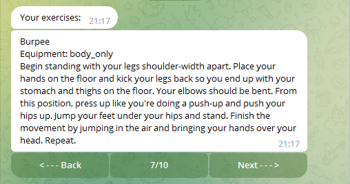
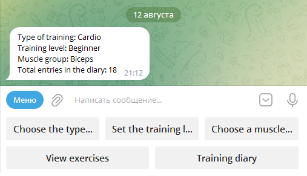
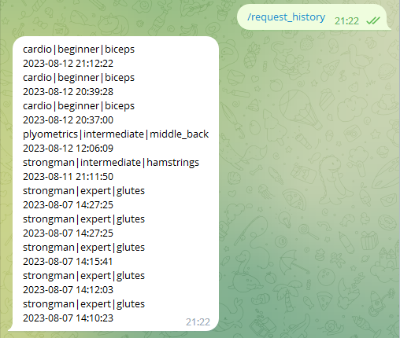
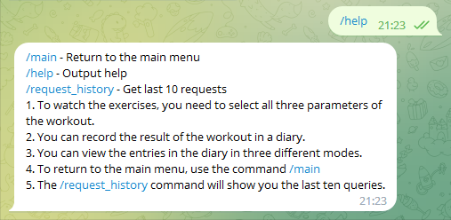
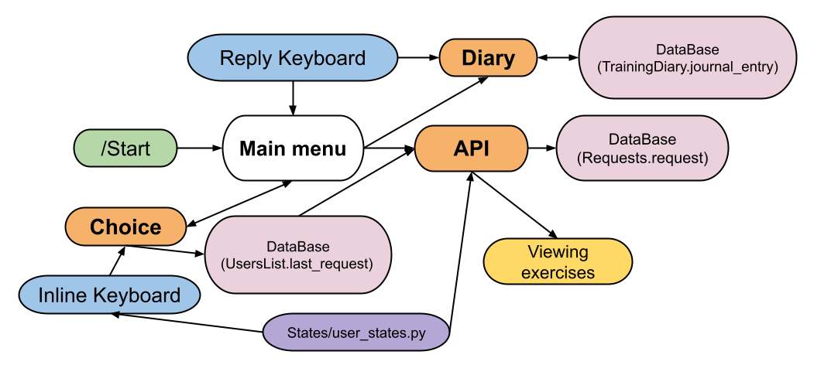

# Бот-тренер
## Описание проекта:
Данный бот, по заданным параметрам, выводит пользователю список упражнений.
Таких параметров всего три:
1. Тип тренировки
2. Уровень тренировки
3. Группа мышц

Вот результат вывода упражнений:  


Так же, этот бот имеет функцию дневника, куда пользователь может записывать результат  
тренировок и отслеживать свой прогресс.

Просматривать записи в дневнике можно тремя способами:
1. Последние десять записей
2. Диапазон записей по номерам
3. Вывод одной записи по номеру
Общее количество записей в дневнике пользователя показано в главном меню:  


У пользователя есть возможность посмотреть, какие запросы он уже делал.  
Команда `/request_history` выводит сообщение с последними десятью запросами:  


Пользователь в любой момент может вернуться в главное меню с помощью команды `/main`.
Подробную информацию о боте, пользователь может вывести командой `/help`:  


## Используемые технологии:
### База данных
База данных содержит в себе три таблицы:
1. UsersList
```python
    from_user_id: int = IntegerField(primary_key=True)  # Содержит ID телеграмма пользователя. Уникальный для всей таблицы
    user_name: str = CharField()  # Содержит first_name пользователя
    last_request: str = CharField(default='None|None|None')  # В этой ячейке хранится выбор параметров пользователя. Используется
    # для отображения в главном меню и для отправки запроса
```
2. Requests
```python
    user: UsersList = ForeignKeyField(UsersList, backref='requests')  # Ключ, ссылающийся на пользователя. По обратной ссылке можно
    # получить все запросы конкретного пользователя
    request: str = CharField()  # Здесь хранится сам запрос, сделанный пользователем
```
3. TrainingDiary
```python
    user: UsersList = ForeignKeyField(UsersList, backref='records')  # Ключ, ссылающийся на пользователя. По обратной ссылке можно
    # получить все записи конкретного пользователя
    journal_entry: str = CharField()  # Здесь хранятся сами записи
```
Все вышеописанные таблицы имеют общую колонку, наследуемую от главной модели
```python
created_at: DateTimeField = DateTimeField(default=datetime.now())
```
Для удобства взаимодействия с базой данных было создано два класса:
- `class RecordOut` - методы данного класса возвращают функции, которые нужны для получения информации из базы данных
Пример метода и возвращаемой функции:
```python
# Метод
@staticmethod
def check_id(from_user_id: int) -> bool:
    return _check_user_id(from_user_id)

# Функция
def _check_user_id(from_user_id: int) -> bool:
    id_list: List[UsersList.from_user_id] = [user_id.from_user_id for user_id in UsersList.select()]
    if from_user_id in id_list:
        return True
    else:
        return False
```
- `class RecordIn` - методы данного класса возвращают функции, которые нужны для записи информации в базу данных
Пример метода и возвращаемой функции:
```python
# Метод
@staticmethod
def regist_user(from_user_id: int, name: str):
    return _user_registration(from_user_id, name)

# Функция
def _user_registration(from_user_id: int, name: str) -> None:
    UsersList.create(from_user_id=from_user_id, user_name=name)
```
### Главное меню
При первом запуске пользователь заносится в базу данных  
Сообщение в главном меню отображает параметры тренировки установленные пользователем.  
Эти параметры хранятся в базе данных, в виде строки, с последующим преобразованием в список.  
Так же, в этом сообщении отображается общее количество записей в дневнике пользователя.
```python
    user_choice: List[str] = RecordOut.last_request(message.from_user.id)
    text_message: str = f'Type of training: {user_choice[0].title()}\n'
                        f'Training level: {user_choice[1].title()}\n'
                        f'Muscle group: {user_choice[2].title()}\n'
                        f'Total entries in the diary: {RecordOut.entry_count(message.from_user.id)}'
    bot.send_message(message.from_user.id, text=text_message, reply_markup=main_markup)
```

В главном меню находится текстовая клавиатура `ReplyKeyboardMarkup`. В ней всего пять кнопок: три активируют  
выбор параметров, четвертая активирует показ упражнений, а пятая открывает меню взаимодействия с дневником

### Выбор параметров
Выбор параметров реализован с помощью `InlineKeyboardMarkup` и коллбэк хэндлера. Сделанный выбор пользователем
улавливается коллбэк хэндлером и записывается в базу данных.

### API сайта
Ответ, полученный от сайта перерабатывается в список, который содержит строки. Каждая строка содержит  
название упражнения, необходимый инвентарь и описание самого упражнения. Строки хранятся в  
удобочитаемом формате.
```python
ready_list: List[str] = list()  # Site`s response will be processed here
    # We will convert each element of the response into a string convenient for output to the user
    for elem in get_exercise(url, headers, querystring):
        ready_string: str = elem['name'] + '\n' + 'Equipment: ' + elem['equipment'] + '\n' + elem['instructions']
        ready_list.append(ready_string)  # Forming a list with ready-made strings
```
Далее, готовый результат сохраняется в стэй пользователя:
```python
    with bot.retrieve_data(user_id=from_user_id) as data:
        data['exercise'] = ready_list
```

### Демонстрация упражнений
Демонстрация упражнений разбита на две функции:
- Первая запускает показ (отправляет в чат с пользователем сообщение с двумя `InlineKeyboardButton`:
 ```python
def start_output(from_user_id: int) -> None:
    exercise_list: List[str] = exercise_list_creating(from_user_id)  # Getting a list of exercises
    page['page'] = 1  # The display always starts from the first page
    page['count'] = len(exercise_list)  # The total number of pages is the total number of exercise
    markup: InlineKeyboardMarkup = InlineKeyboardMarkup()
    # Keyboard contains two buttons: an empty one, a page display and "next"
    markup.add(InlineKeyboardButton(text=f'{page["page"]}/{page["count"]}', callback_data=' '),
               InlineKeyboardButton(text='Next - - - >', callback_data='next_page'))
    # Then this message will just change
    bot.send_message(from_user_id, exercise_list[0], reply_markup=markup)
```
- Вторая продолжает поакз (изменяя ранее отправленное сообщение, где может содержатся уже три `InlineKeyboardButton`):
 ```python
 @bot.callback_query_handler(func=lambda call: call.data in ['next_page', 'back_page'])
def result_output(call) -> None:
    exercise_list: List[str] = exercise_list_creating(call.from_user.id)  # Getting a list of exercises
    page['count'] = len(exercise_list)
    # Now the keyboard can contain 3 buttons: an empty one, a page display, "next" and "back"
    markup: InlineKeyboardMarkup = InlineKeyboardMarkup()
    if call.data == 'next_page':  # Flips forward
        if page['page'] == 1 or page['page'] < len(exercise_list) - 1:  # Condition for all pages except the last one
            page['page'] += 1
            markup.add(InlineKeyboardButton(text='< - - - Back', callback_data='back_page'),
                       InlineKeyboardButton(text=f'{page["page"]}/{page["count"]}', callback_data=' '),
                       InlineKeyboardButton(text='Next - - - >', callback_data='next_page'))
            bot.edit_message_text(f'{exercise_list[page["page"] - 1]}', reply_markup=markup,
                                  chat_id=call.message.chat.id, message_id=call.message.message_id)
        else:  # If the page is the last one
            page['page'] += 1
            markup.add(InlineKeyboardButton(text='< - - - Back', callback_data='back_page'),
                       InlineKeyboardButton(text=f'{page["page"]}/{page["count"]}', callback_data=' '))
            bot.edit_message_text(f'{exercise_list[page["page"] - 1]}\n', reply_markup=markup,
                                  chat_id=call.message.chat.id, message_id=call.message.message_id)
    else:  # Flips back
        if page['page'] == 2:  # Condition for the first page
            page['page'] -= 1
            markup.add(InlineKeyboardButton(text=f'{page["page"]}/{page["count"]}', callback_data=' '),
                       InlineKeyboardButton(text='Next - - - >', callback_data='next_page'))
            bot.edit_message_text(f'{exercise_list[page["page"] - 1]}\n', reply_markup=markup,
                                  chat_id=call.message.chat.id, message_id=call.message.message_id)
        else:  # Condition for all pages except the first one
            page['page'] -= 1
            markup.add(InlineKeyboardButton(text='< - - - Back', callback_data='back_page'),
                       InlineKeyboardButton(text=f'{page["page"]}/{page["count"]}', callback_data=' '),
                       InlineKeyboardButton(text='Next - - - >', callback_data='next_page'))
            bot.edit_message_text(f'{exercise_list[page["page"] - 1]}', reply_markup=markup,
                                  chat_id=call.message.chat.id, message_id=call.message.message_id)

```

И отдельная функция для получения списка упражнений:
```python
def exercise_list_creating(from_user_id: int) -> list:
    with bot.retrieve_data(user_id=from_user_id) as data:
        return data["exercise"]
```

### Дневник тренировок
Все записи пользователей хранятся в одной таблице. Что бы показать пользователю его записи,  
по диапазону или по номеру, сначало формируется список из всех его записей которые есть в базе:
```python
user_notes: List[TrainingDiary.journal_entry] = [note.journal_entry for note in _user.records.order_by(TrainingDiary.id)]
```

Похожий способ используется для получения последних десяти записей:
```python
user_notes: List[TrainingDiary.journal_entry] = [note.journal_entry for note in _user.records.order_by(-TrainingDiary.id).limit(10)]
```

## Архитектура решения
